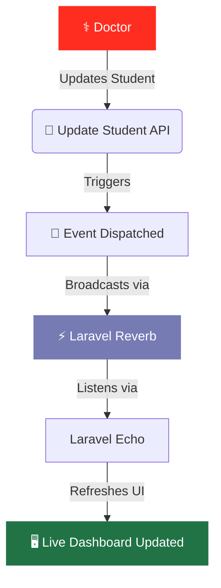

<div align="center">


# 🩺 Organize *Exams*

**A robust Laravel application for managing student exam workflows, doctor accounts, and exam scheduling — powered by Excel imports, real-time updates, and a clean REST API.**

<br>


</div>

---

## 📑 Table of Contents

- [Overview](#-overview)
- [Tech Stack](#-tech-stack)
- [Database Schema](#-database-schema)
- [API Reference](#-api-reference)
- [Installation](#-installation)
- [Configuration](#-configuration)
  - [Google OAuth](#-google-oauth)
  - [Laravel Reverb](#-laravel-reverb)
- [Real-Time Flow](#-real-time-flow)
- [License](#-license)

---

##  Overview

| Feature | Description |
|:-------:|-------------|
| 🧑‍⚕️ **Doctor Auth** | Register & login using **Laravel Sanctum** authentication |
| 📊 **Excel Import** | Bulk-import students from `.xlsx` files via **Laravel Excel** |
| ✅ **Exam Tracking** | Track exam completion progress per student and group |
| 🔐 **Google OAuth** | Secure authentication using **Laravel Socialite** |
|  **Laravel Reverb** | Real-time updates via **WebSockets** & **Laravel Echo** |

---

## 🛠️ Tech Stack

```text
┌─────────────────────────────────────────────────────────┐
│  Backend:  Laravel 12  •  PHP 8.3  •  MySQL            │
│  Auth:     Sanctum  •  Socialite (Google OAuth)         │
│  Realtime: Laravel Reverb  •  Laravel Echo              │
│  Import:   Laravel Excel (Maatwebsite)                  │
│  Frontend: Vite                                         │
└─────────────────────────────────────────────────────────┘
```

---

## 🗄️ Database Schema

### `doctors`
> ‍⚕️ Doctor accounts and authentication records.

```sql
id          — Primary Key
name        — Doctor's full name
email       — Unique email address
password    — Hashed password
google_id   — Google OAuth identifier
avatar      — Profile picture URL
timestamps  — Created & updated at
```

### `subjects`
> 📚 Exam subjects owned by doctors.

```sql
id          — Primary Key
name        — Subject name
doctor_id   — Foreign Key → doctors.id
location    — Exam location/room
```

### `groups`
> 👥 Student exam groups.

```sql
id                  — Primary Key
name                — Group name
number_of_students  — Total student count
doctor_id           — Foreign Key → doctors.id
subject_id          — Foreign Key → subjects.id
time                — Scheduled exam time
```

### `students`
>  Student records and completion status.

```sql
id          — Primary Key
name        — Student's full name
group_id    — Foreign Key → groups.id
done_exam   — Boolean (exam completion status)
```

---

## 🔌 API Reference

### 🌐 Public Endpoints

| Method | Endpoint | Description |
|:------:|----------|-------------|
| `GET` | `/api/students/index` | List subjects with group counts |
| `GET` | `/api/students/showExam/{subjectId}` | View grouped exam data |

### 🔑 Authentication

| Method | Endpoint | Description |
|:------:|----------|-------------|
| `POST` | `/api/doctors/register` | Register a new doctor account |
| `POST` | `/api/doctors/login` | Login & retrieve Sanctum token |
| `GET` | `/api/doctors/logout` | Logout & invalidate session |
| `GET` | `/auth/google` | Redirect to Google OAuth |
| `GET` | `/auth/google/callback` | Handle Google OAuth callback |

### 🛡️ Protected (`auth:sanctum`)

| Method | Endpoint | Description |
|:------:|----------|-------------|
| `POST` | `/api/doctors/index` | Fetch doctor's subjects & groups |
| `GET` | `/api/doctors/show/{id}` | Show doctor profile/details |
| `GET` | `/api/export/{id}` | Export exam data (Excel/CSV) |
| `GET` | `/api/doctors/showExam/{subjectId}` | View doctor's exam data |
| `PUT` | `/api/doctors/updateStudent/{studentId}` | Update student exam status |

---

## 🚀 Installation

Follow these steps to set up the project locally:

```bash
# 1. Clone the repository & install PHP dependencies
git clone <your-repo-url>
cd organize-exams
composer install

# 2. Setup environment & generate key
cp .env.example .env
php artisan key:generate

# 3. Run migrations
php artisan migrate

# 4. Install frontend dependencies & build assets
npm install
npm run dev

# 5. Start the development server
php artisan serve
```

---

## ️ Configuration

### 🔐 Google OAuth

Add your credentials to the `.env` file:

```env
GOOGLE_CLIENT_ID=your_client_id
GOOGLE_CLIENT_SECRET=your_client_secret
GOOGLE_REDIRECT_URL=http://localhost:8000/auth/google/callback
```

Install the Socialite package if not already included:

```bash
composer require laravel/socialite
```

### ⚡ Laravel Reverb

Configure your `.env` for real-time broadcasting:

```env
BROADCAST_CONNECTION=reverb

REVERB_APP_ID=your_app_id
REVERB_APP_KEY=your_app_key
REVERB_APP_SECRET=your_app_secret

REVERB_HOST=127.0.0.1
REVERB_PORT=8080
REVERB_SCHEME=http
```

Start the WebSocket server:

```bash
php artisan reverb:start
```

---

## 🔄 Real-Time Flow

The application uses **Laravel Reverb** and **Laravel Echo** to push live updates to the dashboard whenever a student's exam status changes.



---

## 📜 License

This project is licensed under the **MIT License**.

> Copyright © 2026 **Mohamed Sayed**. All rights reserved.

<div align="center">
  <sub>Built with ❤️ using <a href="https://laravel.com" target="_blank">Laravel</a></sub>
</div>
