<div align="center">

# Organize *Exams*

A robust Laravel application for managing student exam workflows, doctor accounts, and exam scheduling — powered by Excel imports, real-time WebSockets, and a clean REST API.

<br>


</div>

---

## 📑 Table of Contents
- [Overview](#-overview)
- [Database Schema](#-database-schema)
- [API Reference](#-api-reference)
- [Installation & Setup](#-installation--setup)
- [Real-Time Flow](#-real-time-flow)
- [License](#-license)

---

## 🌟 Overview

| Feature | Description |
| :--- | :--- |
| 🧑‍⚕️ **Doctor Auth** | Register & login using Laravel Sanctum token-based authentication. |
| 📊 **Excel Import** | Bulk-import students from `.xlsx` files — auto-creates subjects & groups. |
| ✅ **Exam Tracking** | Mark students complete and monitor live exam progress per group. |
| 🔐 **Google OAuth** | Secure, one-click authentication via Laravel Socialite. |
| ⚡ **Laravel Reverb** | Real-time dashboard updates via WebSockets & Laravel Echo. |

---

## 🗄️ Database Schema

### `doctors`
> Doctor accounts & authentication records.
```sql
id          — Primary Key
name        — Doctor's full name
email       — Unique email address
password    — Hashed password
google_id   — Google OAuth identifier
avatar      — Profile picture URL
timestamps  — Created & updated at
```

### `subjects`
> Exam subjects owned by doctors.
```sql
id          — Primary Key
name        — Subject name
doctor_id   — Foreign Key → doctors.id
location    — Exam location/room
```

### `groups`
> Student exam groups with scheduled times.
```sql
id                  — Primary Key
name                — Group name
number_of_students  — Total student count
doctor_id           — Foreign Key → doctors.id
subject_id          — Foreign Key → subjects.id
time                — Scheduled exam time
```

### `students`
> Student records & completion status.
```sql
id          — Primary Key
name        — Student's full name
group_id    — Foreign Key → groups.id
done_exam   — Boolean (exam completion status)
```

---

## 🔌 API Reference

### 🌐 Public Endpoints
| Method | Endpoint | Description |
| :---: | :--- | :--- |
| `GET` | `/api/students/index` | List subjects with group counts |
| `GET` | `/api/students/showExam/{subjectId}` | View grouped exam data |

### 🔑 Authentication
| Method | Endpoint | Description |
| :---: | :--- | :--- |
| `POST` | `/api/doctors/register` | Register new doctor |
| `POST` | `/api/doctors/login` | Login → Sanctum token |
| `GET` | `/api/doctors/logout` | Revoke token |
| `GET` | `/auth/google` | Redirect to Google OAuth |
| `GET` | `/auth/google/callback` | Handle Google OAuth callback |

### 🛡️ Protected (`auth:sanctum` required)
| Method | Endpoint | Description |
| :---: | :--- | :--- |
| `POST` | `/api/doctors/index` | Import Excel → create groups |
| `GET` | `/api/doctors/show/{id}` | Groups & students for subject |
| `GET` | `/api/export/{id}` | Download Excel export |
| `GET` | `/api/doctors/showExam/{subjectId}` | Exam progress for subject |
| `PUT` | `/api/doctors/updateStudent/{studentId}` | Mark student exam complete |

---

## 🚀 Installation & Setup

### 1. Core Installation
```bash
composer install
cp .env.example .env
php artisan key:generate
php artisan migrate
npm install && npm run dev
php artisan serve
```

### 2. Google OAuth Configuration
Add your credentials to the `.env` file:
```env
GOOGLE_CLIENT_ID=your_client_id
GOOGLE_CLIENT_SECRET=your_client_secret
GOOGLE_REDIRECT_URL=http://localhost:8000/auth/google/callback
```
*Install Socialite if not already included:*
```bash
composer require laravel/socialite
```

### 3. Laravel Reverb Configuration
Configure your `.env` for real-time broadcasting:
```env
BROADCAST_CONNECTION=reverb

REVERB_APP_ID=your_app_id
REVERB_APP_KEY=your_app_key
REVERB_APP_SECRET=your_app_secret

REVERB_HOST=127.0.0.1
REVERB_PORT=8080
REVERB_SCHEME=http
```
*Start the WebSocket server:*
```bash
php artisan reverb:start
```

---

## 🔄 Real-Time Flow

The application uses **Laravel Reverb** and **Laravel Echo** to push live updates to the dashboard whenever a student's exam status changes.

```mermaid
flowchart LR
    A[🧑‍⚕️ Doctor] -->|Updates Student| B(📝 Update Student API)
    B -->|Triggers| C[📡 Event Dispatched]
    C -->|Broadcasts via| D[⚡ Laravel Reverb]
    D -->|Listens via| E[🔊 Laravel Echo]
    E -->|Refreshes UI| F[🖥️ Live Dashboard]

    style A fill:#FF2D20,stroke:#FF2D20,color:#fff
    style F fill:#217346,stroke:#217346,color:#fff
    style D fill:#FFD700,stroke:#FFD700,color:#000
```



---

## 📜 License

This project is licensed under the **MIT License**.

> Copyright © 2026 **Mohamed Sayed**. All rights reserved.

<div align="center">
  <sub>Built with ❤️ using <a href="https://laravel.com" target="_blank">Laravel</a></sub>
</div>
